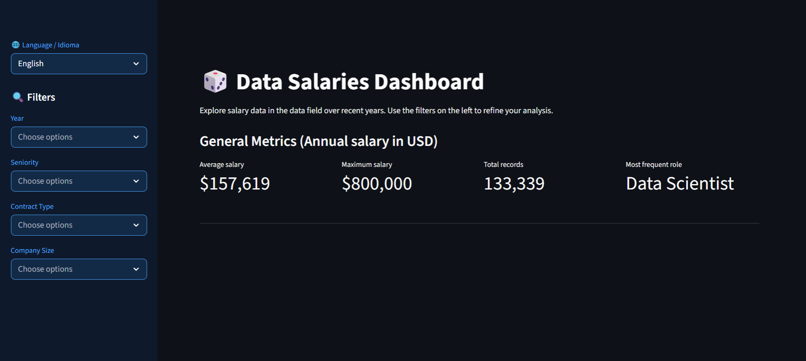
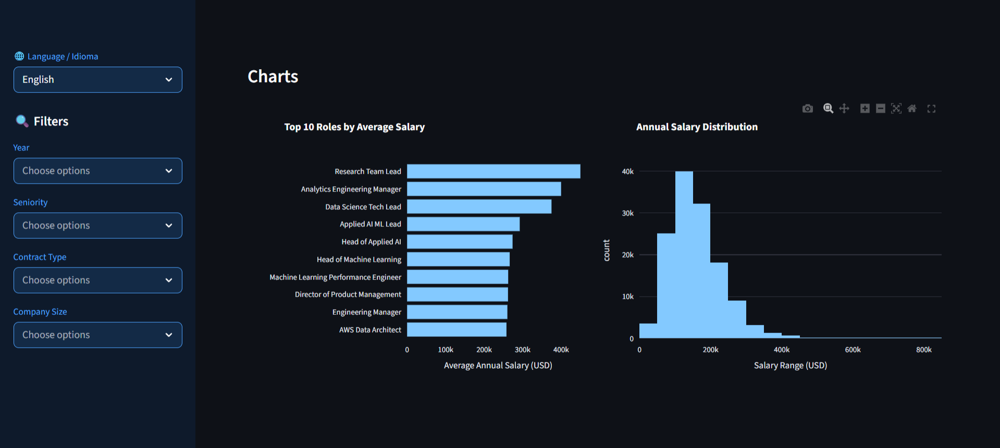
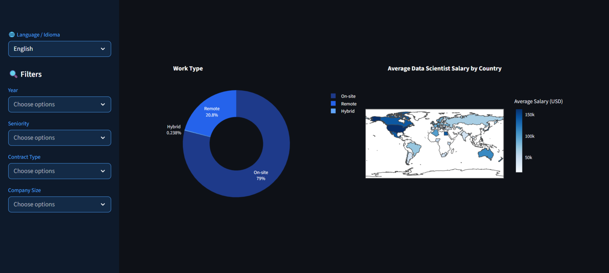
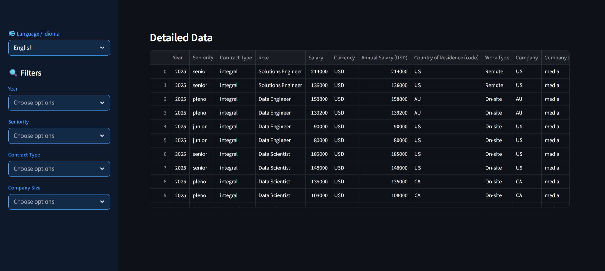

# 📊 Salary Analysis Dashboard in the Data Field
[Traduzir para Português](https://github.com/sthefanyalaminos/dashboard_dados_com_python/blob/main/README.md)

The Dashboard was developed with the goal of performing automated and visual exploratory data analysis, enabling quick interpretation of strategic information through charts and interactive filters.

The application transforms raw data into organized visualizations, making it easier to identify patterns, trends, and relevant insights for decision-making.

<a href="https://dashboard-dadoscompython-alura2026-sthefanyalaminos.streamlit.app/">Click here to access!</a>

## Objective:
Apply the concepts learned during classes, involving:
- Data cleaning and preparation;
- Application of simple filters;
- Insight extraction;
- Statistical analysis;
- Building interactive visualizations.

## Technologies Used:
- Python;
- Pandas;
- Streamlit;
- Plotly.

## Analysis Methodology
The data analysis was conducted in structured steps to ensure organization, clarity, and consistency in the information presented on the dashboard.

1. Data Treatment and Preparation
- Cleaning missing or inconsistent data;
- Standardization of categorical variables;
- Adjustments to numerical and textual data formats.

2. Exploratory Analysis
- Identifying salary patterns;
- Analyzing job title distribution;
- Evaluating the relationship between work model and compensation.

3. Data Visualization
- Building interactive charts to facilitate interpretation using Plotly;
- Using dynamic filters for scenario comparison;
- Visual organization focused on clarity and accessibility.

## Implemented Improvements
Beyond the structure proposed during Alura's Imersão Dados com Python, improvements were made with the goal of making the dashboard more intuitive, accessible, and visually consistent.

### Visual Standardization
A visual identity in shades of blue was applied, aiming for greater aesthetic consistency and a better data reading experience.
The standardization contributes to a more organized interface, making it easier to interpret the information presented.

### Enhanced Filters
The filter logic was adjusted to make navigation simpler and more intuitive for the user:
- When no selection is made, all data is displayed automatically.
- When a specific filter is selected, the dashboard shows only the data for that period / category.
- Multiple filters can be selected, also allowing comparisons between different periods.
- When all selections are removed, the dashboard automatically returns to the full data view.
This improvement makes data exploration more practical and flexible.

### Multi-Language Support
The option to view the dashboard in Portuguese and English was implemented, allowing users from different contexts to explore the application. This feature broadens the project's reach and improves its accessibility for an international audience.

## Authorship:
Project developed based on Imersão - Dados com Python, offered by Alura, with final modifications by Sthefany Alaminos, for the study and consolidation of knowledge in Python and data analysis.